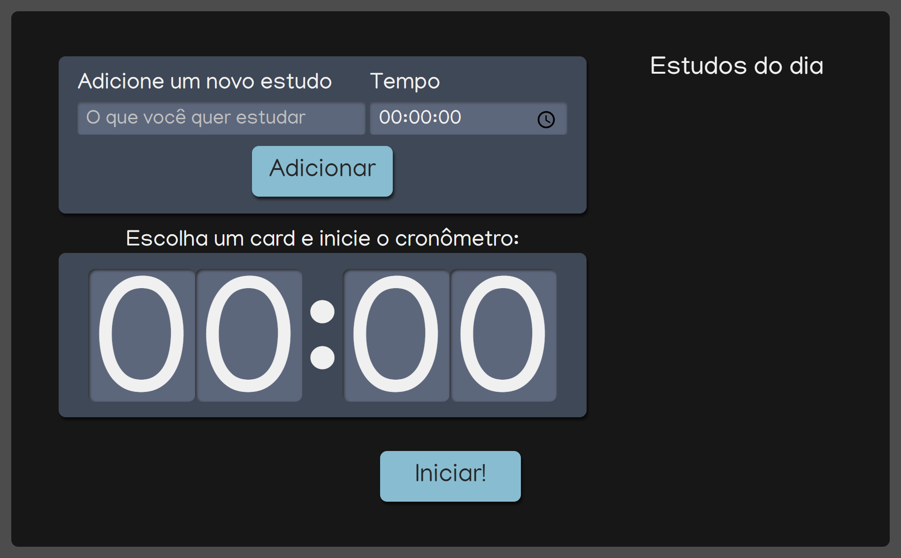

# Projeto Alura Studies

Este projeto foi desenvolvido durante o curso React: escrevendo com TypeScript da plataforma Alura.
Meu objetivo com este curso foi aprofundar e aprender mais sobre React com TypeScript.

## Available Scripts

Para iniciar a aplicação você precisará do comando:

### `npm start`

A aplicação está disponivel na Vercel no link abaixo:

### `projeto-alura-studies.vercel.app`

## Alura Studies

